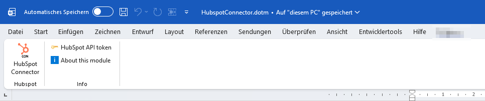

# hubspot-word-vba-connector
A VBA-based connector for Microsoft Word to fetch HubSpot CRM data via API v3. Features secure Windows Registry storage for API keys and a custom GUI.

# HubSpot VBA Connector for MS Word
This project provides a VBA-based solution to integrate HubSpot CRM data directly into Microsoft Word documents. It allows users to fetch Contact and Company information via the HubSpot API v3 and populate Word templates automatically.I use it form myself to fill out bookmarks and custom document property within documments. In the Code, this featurcommented-out codee is active. 

For specific templates in my company, I also refer to a specific cells in a table, and I also read out user informations from Active Directory to populate the templates. This part of the code is commented-out but feel free to use ist.

## Features
* **API Integration:** Connects to HubSpot CRM API v3.
* **Secure Key Management:** Stores API tokens in the **Windows Registry** instead of hardcoding them in the script.
* **Custom GUI:** Includes a UserForm for easy configuration and API key management.
* **Error Handling:** Built-in validation for API responses and missing configuration keys.

## Technical Prerequisites
To run this project, ensure the following references are enabled in your VBA Editor (**Tools > References**):
* `Visual Basic For Applications
* `Microsoft Word 16.0 Object Library
* `OLE Automation
* `Microsoft Office 16.0 Object Library
* `Microsoft Forms 2.0 Object Library
* `Microsoft Scripting Runtime
* `Microsoft Forms 2.0 Object Library`

## Installation
1. Download the source files (`.bas`, `.cls`, `.frm`, `.frx`).
2. Alternatively, and if you trust me 😇, _HubspotConnector.dotm_ already has all the modules and forms built in.
3. Open Microsoft Word and press `ALT + F11` to open the VBA Editor.
4. Right-click on your project and select **Import File...** to add all downloaded components.
5. Run the main macro to open the setup GUI and enter your HubSpot Private App Access Token.

## Ribbon

To provide the users the possibility to start the Connector and Enter / Change their API Key, I use a "Custom Ribbon" included . If you use the provided file _HubspotConnector.dotm_ the ribbon will appear automatically.
Otherwise, you need the edit your newly built Microsoft Word file's XML structure.
Use the [Office RibbonX Editor](https://github.com/fernandreu/office-ribbonx-editor) for this. You can open the existing _HubspotConnector.dotm_ file and extract it's content or refer to [Ribbon](https://github.com/Micharius/hubspot-word-vba-connector/tree/main/ribbon) for the XML content and ribbon icons

## Get API Key
Follow the steps proviced in [Get Hubspot API Key.pdf]([https://www.example.com](https://github.com/Micharius/hubspot-word-vba-connector/blob/main/Get%20Hubspot%20API%20Key.pdf)) to generate the API key

## Tipps
You can install the ready prepared *.dotm template in your Startup directory: %appdata%\Microsoft\Word\STARTUP
The *.dotm file will be loaded everytime your start Microsoft Word. The ribbon will also appear.

## Security Note
Settings are stored locally in the Windows Registry under:
`HKEY_CURRENT_USER\Software\VB and VBA Program Settings\`
This ensures that your API keys remain private to your Windows user profile.

## License
This project is licensed under the MIT License.

## Populate your document
Bookmarks I use are:

* `bkmConName
* `bkmConEmail
* `bkmCustAddress1
* `bkmCustAddress2
* `bkmCustWebAddress
* `bkmConPhone
* `bkmConMobile
* `bkmCustWebAddress

Custom document properties I use are:
* `prpCustCompany

## Tools & Libraries Used
* **[VBA-JSON](https://github.com/VBA-tools/VBA-JSON):** Used for parsing API responses from HubSpot. (MIT License)
* **[Office RibbonX Editor](https://github.com/fernandreu/office-ribbonx-editor):** Used to design and implement the custom Ribbon interface in the Word template. (MIT License)
